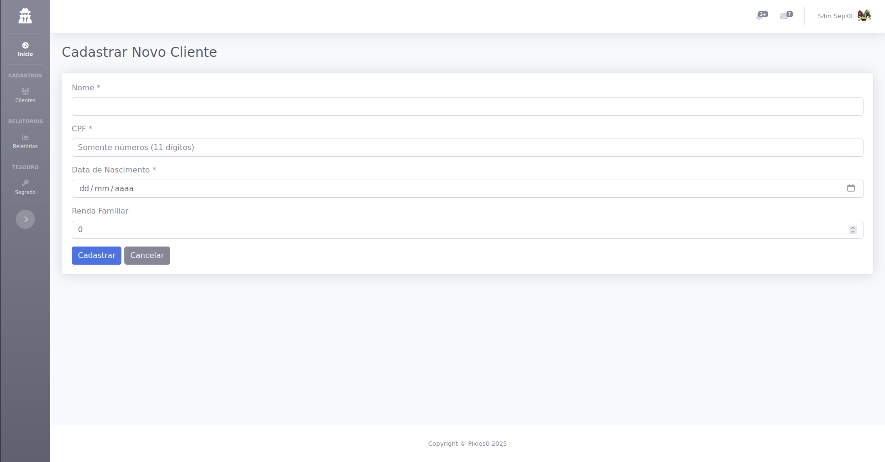

# 💼 Sistema Gerenciador de Clientes (SGC)

Este é um sistema web para cadastro, listagem e análise de clientes, desenvolvido com PHP e utilizando o tema [SB Admin 2](https://startbootstrap.com/theme/sb-admin-2) para a interface.

## ✅ Funcionalidades

- Cadastro de clientes com nome, CPF, data de nascimento e renda familiar
- Listagem de clientes com busca por nome
- Dashboard com indicadores e gráficos:
  - Média de idade e renda
  - Gráficos interativos com Chart.js
  - Filtro por período (mês, semana, dia)
  - Total de clientes por classe (A, B, C)
  - Clientes maior de idade com renda superior a média

## 🚀 Como executar o projeto localmente

### 1. Clone o repositório

```bash
git clone https://github.com/pixies0/SGC.git
cd SGC
```
### 2. Crie o Banco de dados

Use um SGBD de sua preferência (como PGAdmin, MySQLWorkbench, etc.).
Eu usei o DBeaver no meu caso

* Crie um novo banco de dados chamado sgc (ou qualquer nome que preferir)
* Execute o seguinte script SQL:

```
CREATE TABLE clientes (
    id SERIAL PRIMARY KEY,
    nome VARCHAR(150) NOT NULL,
    cpf VARCHAR(11) UNIQUE NOT NULL,
    data_nascimento DATE NOT NULL,
    data_cadastro DATE NOT NULL DEFAULT CURRENT_DATE,
    renda_familiar DECIMAL(10,2)
);
```

### 3. Configure o acesso ao banco

Abra o arquivo de configuração localizado ```config/database.ini```

Edite os dados de acordo com seu ambiente:

```
host = localhost
port = 5432
dbname = sgc
username = seu_usuario
password = sua_senha
```

### ⚠️ Importante: Certifique-se de que o banco está rodando e acessível.

### 4. Inicie o servidor local

Use o servidor embutido do PHP para rodar a aplicação localmente:

```
php -S localhost:8000 -t public
```

Acesse em seu navegador:

```
http://localhost:8000
```

## 📁 Estrutura do projeto

```
SGC/
├── config/            # Arquivo de configuração do banco
├── public/            # Pasta pública acessada pelo navegador
│   └── index.php      # Roteador
├── src/
│   ├── Controllers/   # Controladores da aplicação
│   ├── Models/        # Modelos (Cliente)
│   ├── Repositories/  # Acesso ao banco de dados
│   └── Helper/        # Utilitários
├── views/             # Views HTML renderizadas
└── README.md          # Este arquivo :)
```

## Tecnologias utilizadas

* PHP puro (sem framework)
* PDO (abstração de banco de dados)
* HTML, CSS, JavaScript
* SB Admin 2 Theme (Bootstrap 4)
* Chart.js (gráficos)
* Font Awesome

## 📸 Captura de Tela



---

i try my best!!
